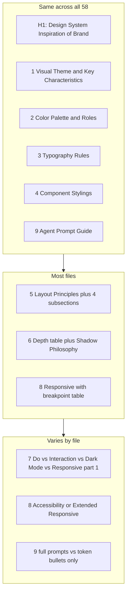

# Analysis: DESIGN.md structure, commonalities, and differences

*Project: [design-o-mat](https://github.com/CodeCubicle-Org/design-o-mat). Source corpus: flat export of [VoltAgent/awesome-design-md](https://github.com/VoltAgent/awesome-design-md). Document date: 2026-04-07.*

## What this corpus is

[`voltagent-awesome-design-md-8a5edab282632443.txt`](./voltagent-awesome-design-md-8a5edab282632443.txt) is a **flat dump** of that repository: a directory tree plus file contents separated by `================================================` and `FILE: …` headers. It contains **58** `design-md/<slug>/DESIGN.md` files (confirmed by counting `FILE: design-md/.*/DESIGN.md` markers), each paired with `README.md`, `preview.html`, and `preview-dark.html`.

The root embedded README in that dump (~lines 330–378) frames the work: copy a `DESIGN.md` into a project and point an AI agent at it; format aligns with [Google Stitch — DESIGN.md overview](https://stitch.withgoogle.com/docs/design-md/overview/) / [format](https://stitch.withgoogle.com/docs/design-md/format/), with the awesome-design-md repo adding **extra sections** (notably the **Agent Prompt Guide**).

---

## What is universal across all 58 `DESIGN.md` files

| Convention | Detail |
|------------|--------|
| **Title** | Every file opens with `# Design System Inspiration of {Brand}` — consistent H1 for retrieval and chunking. |
| **Nine numbered top-level sections** | Always `## 1.` … `## 9.` — numbers give agents a stable index (“see section 4”). |
| **Section 1 name** | Always **Visual Theme & Atmosphere**. |
| **`**Key Characteristics:**` block** | Present in **all 58** files (grep count) — a fixed anchor after the narrative intro in section 1. |
| **Section 2 name** | Always **Color Palette & Roles** (same wording everywhere in corpus). |
| **Section 3 name** | Always **Typography Rules**. |
| **Section 4 name** | Always **Component Stylings**. |
| **Section 9 name** | Always **Agent Prompt Guide** — the repo’s explicit bridge from tokens to natural-language UI tasks. |
| **Color token line pattern** | Very common: `**Name** (\`#hex\`): role…` plus optional CSS variables (`--palette-*`, `--theme_*`, `--color-*`, etc.). |
| **Depth section narrative** | Many fuller docs add a prose **Shadow Philosophy** paragraph after elevation tables, stating whether shadows are layered, border-only, or absent. |
| **Responsive subsection pattern** | When section 8 is standard **Responsive Behavior**, it often repeats the same four `###` blocks: **Breakpoints**, **Touch Targets**, **Collapsing Strategy**, **Image Behavior** (breakpoint tables are common on marketing-heavy sites). |

---

## Section-by-section: what is typical and how files diverge

### Section 1 — Visual Theme & Atmosphere

**Common shape**

1. Two to four paragraphs of **editorial prose**: metaphor (“travel magazine,” “terminal aesthetic,” “hardware rendered in pixels”), emotional tone, and **why** the palette or type choices exist — not only what they are.
2. Optional mid-section callouts of **technical differentiators** (e.g. Airbnb’s `--palette-*` tokens and three-layer shadows; Cursor’s `oklab()` borders).
3. **`**Key Characteristics:**`** bullet list: 6–12 bullets mixing **hex values**, **font names**, **radius rules**, and **behavioral rules** (e.g. “zero chromatic color”).

**Variation**

- **Length**: “Thick” files (Airbnb, Cursor, Ollama, NVIDIA) run long; “thin” files (Airtable, Webflow) compress section 1 to one short paragraph plus a short bullet list.
- **Extraction metadata**: Some docs cite **observed** facts from the public site (e.g. Airbnb “61 detected breakpoints”; OpenCode “zero box-shadows detected”) — useful for agents to treat values as **empirical**, not invented.

### Section 2 — Color Palette & Roles

**Common shape**

- Grouping via `###` headings whose **names vary by brand**: e.g. **Primary Brand**, **Semantic**, **Neutrals**, **Interactive States**, **Surface & Shadows**, **Extended Brand Palette** (NVIDIA), **Timeline / Feature Colors** (Cursor).
- Bullets that tie **semantic role** to **implementation** (“never as large surface,” “focus only”).

**Variation**

- **Variable naming**: Some sites emphasize extracted CSS custom properties; others are hex-only.
- **Shadows listed under color**: Richer files often duplicate shadow strings here and again in section 6 for redundancy (helps LLMs that only read part of the doc).

### Section 3 — Typography Rules

**Common shape**

- `### Font Family` or `### Font Families` (singular vs plural — both appear).
- **Hierarchy table**: columns typically include Role, Font, Size, Weight, Line Height, Letter Spacing; **Notes** column appears in fuller specs (Airbnb, Cursor) and may be omitted in minimal specs (Webflow’s table drops Font column and uses Size-only in places).
- `### Principles` bullet list in thicker files: tracking rules, weight discipline, multi-voice systems (e.g. Cursor: gothic + serif + mono).

**Variation**

- **Multi-font systems** get extra subsections (display vs body vs mono vs icons).
- **OpenType features** called out when relevant (`"salt"`, `"cswh"`, `"ss09"`).

### Section 4 — Component Stylings

**Common shape**

- `### Buttons` almost always present; then some mix of **Cards**, **Inputs**, **Navigation**, **Image Treatment**.
- Richer files define **named variants** (e.g. “Primary Dark,” “Gray Pill”) with **padding, radius, hover/focus** spelled out.

**Variation**

- **Thin style**: merged one-liners, e.g. `### Cards: \`1px solid #e0e2e6\`, 16px–24px radius` (Airtable).
- **Product-specific blocks**: e.g. Ollama’s **Terminal Command Block**, **Model Tags**; Cursor’s **AI timeline** colors.

### Section 5 — Layout

**Titles in corpus**

- Most common: **`## 5. Layout Principles`** with four subsections: **Spacing System**, **Grid & Container**, **Whitespace Philosophy**, **Border Radius Scale**.
- Shorter files use **`## 5. Layout`** with bullets only (Airtable, Webflow) — sometimes **folding breakpoint numbers into section 5** (Webflow) instead of section 8.

**Variation**

- **Whitespace philosophy** is where the prose argues **density vs air** (Mintlify “documentation-grade breathing room,” Ollama “emptiness as luxury”).

### Section 6 — Depth & Elevation

**Titles in corpus**

- Usually **`## 6. Depth & Elevation`**; occasionally **`## 6. Depth`** (shorter).
- One descriptive title: **Webflow** uses `## 6. Depth: 5-layer cascading shadow system` (content still fits the same slot).

**Common shape**

- Elevation **table**: Level name → CSS treatment → use case.
- **`**Shadow Philosophy**`** paragraph explaining layered vs flat vs border-only.

**Variation**

- **No-shadow systems** still get a level table or philosophy paragraph (Ollama, OpenCode) so agents do not “helpfully” add shadows.

### Section 7 — largest structural variance (important correction)

The root README describes an ideal **“Do’s and Don’ts”** slot here, but the **corpus does not always use that title**.

| Section 7 content | Example brands | Implication |
|-------------------|----------------|-------------|
| **`## 7. Do's and Don'ts`** with `### Do` / `### Don't` | Airbnb, Apple, Ollama, most of the collection | Default guardrail pattern. |
| **`## 7. Interaction & Motion`** (`### Hover States`, `### Focus States`, `### Transitions`) | **Cursor**, **opencode.ai** | Do/Don’t guidance is **folded into** interaction detail; no separate Do/Don’t header. |
| **`## 7. Dark Mode`** | **Mintlify** | Documents light/dark token flips **here**; standard **Responsive Behavior** moves to **section 8**, **Agent Prompt Guide** stays **section 9**. |
| **`## 7. Responsive Behavior`** (first responsive block) | **NVIDIA** | **No Do’s and Don’ts section**; responsive content is **split** across 7 and 8. |
| **(No section 7 Do’s)** — **Accessibility** promoted | **Notion** | **`## 7. Responsive Behavior`**, then **`## 8. Accessibility & States`** (focus, interactive states, contrast notes), then **`## 9. Agent Prompt Guide`**. |

So: **the number “7” is stable**, but **the semantic role of section 7** sometimes swaps **guardrails** for **motion**, **dark mode**, or an **extra responsive pass**. Agents should rely on **headings**, not assume “section 7 = Do’s.”

### Section 8 — responsive and more variance

| Pattern | Examples |
|---------|----------|
| **`## 8. Responsive Behavior`** + four standard `###` blocks | Majority of thick marketing specs |
| **`## 8. Accessibility & States`** | **Notion** — WCAG-style notes, focus system, state list |
| **`## 8. Responsive Behavior (Extended)`** | **NVIDIA** — typography scaling + dark/light section strategy (follows section 7 responsive) |
| **`## 8. Responsive: 479px, 768px, 992px`** | **Webflow** — minimal; mirrors compressed layout in section 5 |

### Section 9 — Agent Prompt Guide

**Common shape (fuller files)**

- `### Quick Color Reference` — short list of the **most-used** colors/borders.
- `### Example Component Prompts` — **quoted strings** ready to paste into an agent (“Create a hero section…”, “Design a card…”).
- `### Iteration Guide` — numbered checklist (often 5–8 steps) reinforcing **non-obvious** rules (pill radius, border opacity caps, warm-gray-only neutrals).

**Variation**

- **Minimal section 9**: only bullet tokens, no quoted prompts (Airtable, Webflow) — still valid but less **operational** for few-shot prompting.

---

## Common vs different — summary matrix

**Writing style — what the corpus does consistently for LLMs**

- **Concrete CSS literals** for shadows, borders, and rings (reduces hallucinated values).
- **Explicit negations** (“never as background,” “zero shadows,” “no gradients”).
- **Semantic naming** beside hex (agents map tokens to roles).
- **Hierarchy tables** for typography and elevation (dense, parse-friendly).
- **Section 9** as **few-shot examples** where the author invested effort.

**Companion artifacts (per folder)**

- **`README.md`**: legal/accuracy disclaimer, link to GitHub `DESIGN.md`, preview screenshots (R2-hosted).
- **`preview*.html`**: visual token board; often uses **Google Fonts substitutes** (e.g. Inter) where the real brand font is not available — the **DESIGN.md** still names the **true** brand fonts.

---

## Gaps corrected from the first analysis pass

1. **Section 7 is not always Do’s and Don’ts** — Cursor, OpenCode, Mintlify, Notion, NVIDIA diverge as documented above.
2. **Section 8 is not always only responsive** — Notion adds accessibility; NVIDIA adds “Extended” responsive.
3. **Section titles are sometimes shortened or descriptive** (`Layout`, `Depth`, `Responsive: 479px…`) without breaking the 1–9 numbering.
4. **`Key Characteristics` is a universal fixture** in section 1 (58/58), not just a common pattern.
5. **Extraction-style notes** (“N breakpoints detected,” “zero shadows detected”) appear in some docs and signal **scraped/observed** fidelity limits.

---

## Optional next steps

- Compare this corpus line-by-line with [Stitch’s official format](https://stitch.withgoogle.com/docs/design-md/format/) to list **required vs extended** sections.
- When authoring a new `DESIGN.md`, **keep sections 1–6 and 9** dense; for section **7–8**, either follow the **Do’s + Responsive** pattern **or** deliberately substitute (like Notion/Cursor) but **keep nine sections** and **clear headings** so agents do not mis-parse.
